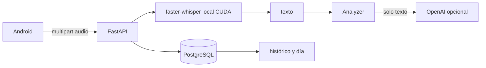
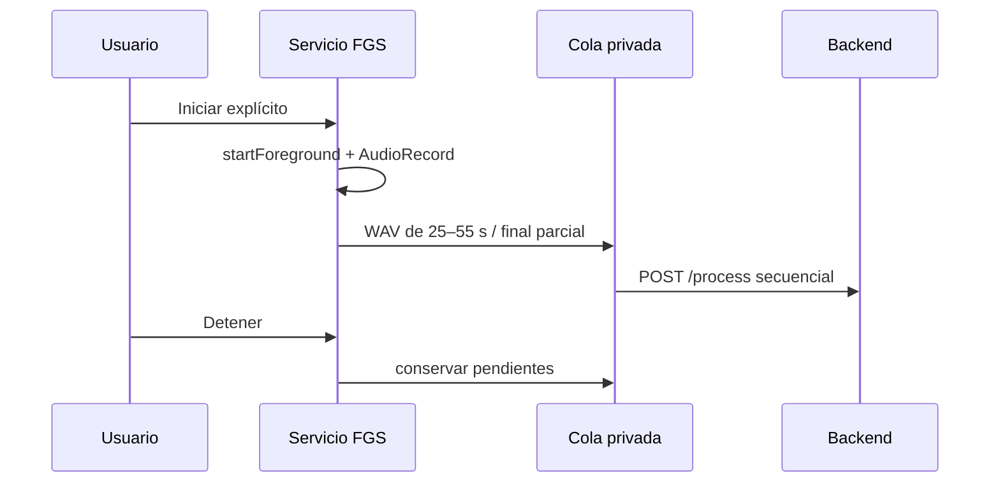
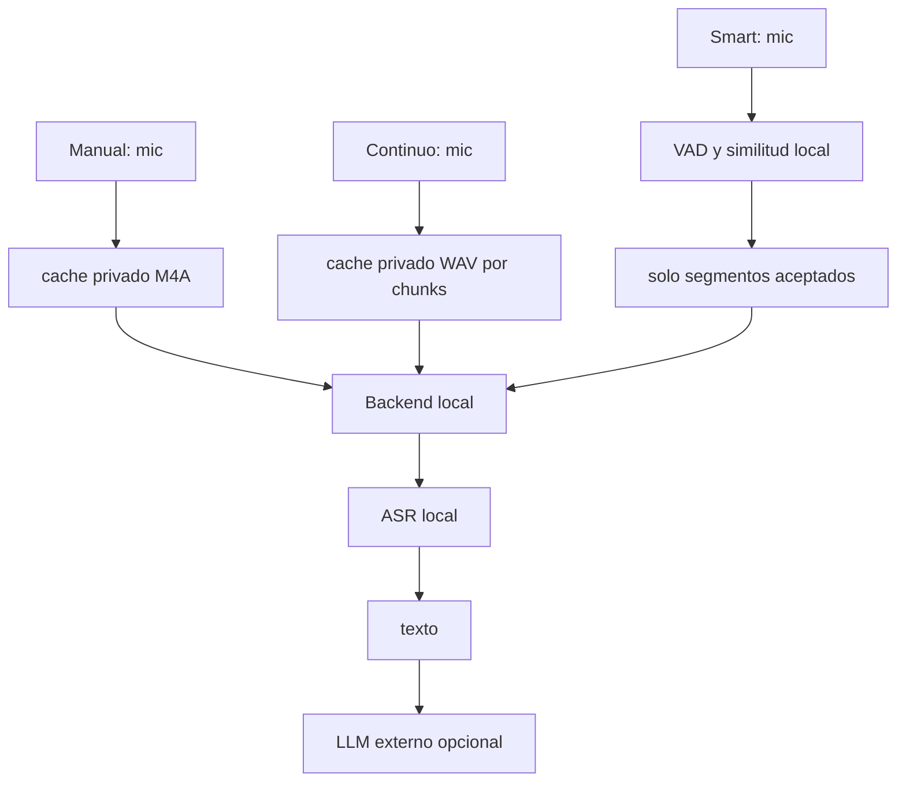

# Borrador técnico de memoria del TFM

> Estado: borrador basado en el repositorio. La validación física SMART en Pixel 8 ya está documentada; la batería, la precisión general del VAD y las métricas formales de speaker siguen sin medirse.

## 1. Resumen

Este trabajo presenta una plataforma local-first para construir un diario personal a partir de voz. Un cliente Android captura audio manual, continuo o selectivo; un backend FastAPI recibe el audio, ejecuta transcripción local con faster-whisper y convierte el texto en información estructurada mediante un proveedor LLM desacoplado. PostgreSQL conserva las interacciones y los resúmenes diarios. El diseño limita el tamaño y duración del audio, mantiene los ficheros temporales en almacenamiento privado y evita enviar audio al proveedor externo. La evaluación automatizada cubre contratos, persistencia y extracción estructurada; el ASR FLEURS sigue pendiente y la validación física SMART queda limitada a los resultados documentados en Pixel 8.

## 2. Abstract

This thesis develops a local-first platform for building a personal diary from voice recordings. An Android client supports manual, continuous and experimental selective capture. A FastAPI backend receives audio, performs local transcription with faster-whisper, and extracts structured information through a replaceable LLM provider. PostgreSQL stores interactions and daily summaries. The design limits audio size and duration, keeps temporary files private, and sends derived text rather than audio to the external provider. Automated tests cover contracts, persistence and evaluation infrastructure. A limited Pixel 8 validation shows that the hardened energy VAD suppresses the tested silence false positives, while the acoustic speaker baseline is non-discriminative in the observed conditions.

## 3. Palabras clave

Diario personal, reconocimiento automático del habla, Whisper, LLM, Android, privacidad, local-first, VAD.

## 4. Introducción y 5. Motivación

Las notas de voz contienen contexto que se pierde cuando solo se guardan palabras clave manuales. Sin embargo, grabar continuamente introduce riesgos de privacidad, almacenamiento y consumo. El proyecto explora un flujo pequeño y reproducible que conserva el control local del audio y usa un servicio externo únicamente para análisis textual cuando está configurado.

## 6. Objetivos

El objetivo principal es diseñar, implementar y evaluar una plataforma modular de diario de voz. Los objetivos concretos son recibir y procesar una grabación, obtener una transcripción local, extraer decisiones/tareas/recordatorios estructurados, persistir y consultar interacciones, generar un resumen diario determinista en sus datos de entrada, y ofrecer tres políticas Android de captura. El modo inteligente se considera experimental y no condiciona por sí solo la validez del MVP.

## 7. Alcance

El alcance real incluye un backend local con API HTTP, PostgreSQL y Compose, una aplicación Android con captura manual y el incremento avanzado de captura continua/selectiva. No incluye autenticación completa, multiusuario, despliegue público, workers distribuidos, diarización general, entrenamiento o infraestructura Kubernetes/RabbitMQ/Redis/S3.

## 8. Estado del arte y tecnologías

Whisper es un sistema multilingüe de reconocimiento entrenado con supervisión débil a gran escala [Radford2022]. La implementación usa faster-whisper/CTranslate2 para ejecutar el modelo localmente con CUDA. FastAPI proporciona contratos HTTP y validación Pydantic; SQLAlchemy y Alembic separan acceso a datos y evolución del esquema; PostgreSQL JSONB conserva el contrato de análisis sin crear tablas hijas prematuras. Android usa Kotlin, Compose, `MediaRecorder` para la nota manual y `AudioRecord` para PCM continuo.

## 9. Requisitos

Funcionales: iniciar/detener manualmente, enviar audio, consultar histórico, consultar un día y generar resumen explícitamente; iniciar/detener captura continua o smart con notificación visible; conservar fallos de subida como pendientes. No funcionales: límites de 10 MiB/60 s en backend, timestamps UTC, errores sin secretos, audio temporal privado, pruebas reproducibles y proveedor LLM sustituible.

## 10. Diseño y arquitectura

La petición `/process` es síncrona: transcribe, analiza y persiste antes de responder. La exclusión mutua evita cargas concurrentes no controladas sobre el modelo en el proceso único. El resumen diario solo envía al analizador una proyección de datos derivados y recalcula un fingerprint para detectar cambios.

## 11. Implementación backend

`app/main.py` gestiona rutas, límites, temporales y ciclo de vida. `app/transcription.py` mantiene el transcriptor y traduce segmentos a texto. `app/analysis.py` define `Analyzer` y el proveedor OpenAI con Structured Outputs. Los errores del proveedor se mapean a respuestas HTTP sin exponer detalles. La petición multipart se cierra en `finally`; esto reduce residuos, aunque los límites de recepción antes del parsing siguen siendo una limitación del prototipo local.

## 12. ASR

El audio se decodifica localmente y se rechaza si excede 60 segundos. El modelo efectivo informa de modelo, dispositivo y tipo de cálculo. La evaluación FLEURS usa WER y CER después de una normalización conservadora; RTF es tiempo de inferencia dividido por duración. Los valores medidos deben proceder de `evaluation.asr.run`; en ausencia de esos artefactos el resultado es **NO MEDIDO**.

## 13. Análisis LLM

El contrato contiene resumen, temas, decisiones, tareas y recordatorios. Structured Outputs reduce errores de forma, pero no garantiza verdad semántica. Cada evidencia se valida contra el texto de entrada. `store=false` evita persistencia de estado de la respuesta en esa función, pero no equivale a retención cero: las políticas y controles del proveedor son independientes. El fixture de 36 casos es sintético, por lo que no representa conversaciones reales.

## 14. Persistencia

Las interacciones se almacenan con timestamps con zona horaria normalizados a UTC y `recorded_at` se usa para el intervalo local del día. Los datos estructurados se guardan como JSONB. La migración es la fuente de verdad y no se ejecuta `create_all()` al arrancar. El histórico usa paginación por límite/offset, suficiente para el uso personal del TFM; un producto multiusuario requeriría revisar esta decisión.

## 15. Android

La aplicación usa ViewModel/StateFlow para que la UI sobreviva a recomposiciones y separe estado de efectos. El audio temporal se almacena en `cacheDir`. El manifest declara micrófono, foreground service general, tipo microphone y notificaciones. La captura continua solo se inicia por acción explícita mientras la actividad está visible; el servicio llama a `startForeground` antes de capturar y ofrece acción de detener.

## 16. Captura manual

`MediaRecorder` crea un M4A temporal, registra el instante inicial y libera el recurso en parada o descarte. La pantalla diferencia Idle, Recording, Ready, Processing, Success y Error. Un fallo de red conserva el fichero para reintento manual; el éxito lo elimina.

## 17. Captura continua

`AudioRecord` usa mono PCM16 a 16 kHz. Las lecturas parciales se acumulan sin perder muestras y se dividen en WAV: no se corta antes de 25 segundos, se busca una pausa acústica de 800 ms y existe un hard cap de 55 segundos; el último segmento puede ser parcial. `SegmentQueue` tiene capacidad limitada y conserva los ficheros fallidos para una futura reanudación del servicio. Las subidas son seriales y cada chunk lleva sesión, índice y UUID idempotente.

## 18. Captura inteligente

El modo smart es experimental. Un framer convierte lecturas parciales en frames de 20 ms; una calibración inicial de 2 s estima el ruido; un ring buffer añade pre-roll; y un VAD energético adaptativo exige 10 frames consecutivos (200 ms) y cierra tras 800 ms de silencio. La similitud acústica usa una representación simple de media, energía y cruces por cero. La prueba física mostró 0 detecciones en silencio, pero también scores 1.0000 para voz propia y otra voz. Por tanto, este componente es un baseline experimental fallido/no discriminativo, no biometría ni speaker verification. El audio descartado no se guarda como segmento pendiente.

## 19. Privacidad y minimización

El audio no se envía a OpenAI; sí puede salir texto derivado si el usuario configura el proveedor. No se incluyen claves, audios personales ni transcripciones privadas en Git. Grabar a terceros exige consentimiento y revisión legal; el prototipo no resuelve por sí mismo obligaciones GDPR.

## 20. Estrategia de pruebas

Los tests JVM cubren ViewModel, JSON/Retrofit, cola, WAV, VAD, ring buffer y similitud. El backend prueba rutas, validación, errores, persistencia, timezones y contratos. CI rápido no prueba hardware ni GPU. Existe un workflow separado para instrumentación/emulador, pero su ejecución real queda pendiente si no se dispone de GitHub dispatch.

## 21. Evaluación experimental

ASR: FLEURS español, validation, seed fija, modelos base/small y resume. LLM: 36 casos sintéticos, una llamada por caso, matching 1:1 por evidencia y métricas PRF. Smart: evaluación funcional sintética y validación física limitada en Pixel 8, sin presentarla como precisión general de voz. Speaker: la prueba física mínima fue no discriminativa; FAR/FRR formales siguen sin medirse. Batería: baseline idle, continuous y smart durante 15–30 minutos.

## 22. Resultados

ASR: [RESULTADO REAL PENDIENTE: corpus WER/CER, latencia, RTF, fallos y carga para base/small]. Tras reforzar de forma general la instrucción de evidencia literal, el desarrollo LLM obtuvo 36/36 respuestas válidas, micro precision=0,763, recall=0,935 y F1=0,841; el holdout sintético independiente obtuvo 15/15 válidas y micro F1=1,000. Son resultados de corpus pequeños y no prueban exactitud general. Smart físico: en Pixel 8, silencio produjo 0 detecciones y 0 POST; tres frases del usuario produjeron 3 detecciones y 3 envíos. Una frase se segmentó en dos por una pausa larga y Logcat registró cuatro segmentos con score 1.0000. Otra voz produjo cuatro segmentos observados, todos con score 1.0000 y 0 descartes. Speaker: el baseline no discriminó hablantes en esta prueba; no se calculan FAR/FRR formales.

## 23. Discusión

La separación ASR local/LLM externo permite reducir la exposición de audio y sustituir el proveedor, a costa de enviar texto y depender de conectividad, coste y políticas externas. La persistencia síncrona simplifica las fronteras transaccionales; una caída después del commit se mitiga para Continuous con `capture_chunk_id` UNIQUE y devolución del resultado existente en el retry. La segmentación sigue siendo acústica y el análisis semántico sigue siendo por chunk.

## 24. Limitaciones

FLEURS es habla leída; no representa conversaciones espontáneas. Una sola ejecución LLM no mide variabilidad. La prueba física detectó un falso positivo del VAD que no estaba cubierto por los tests sintéticos y motivó su calibración y endurecimiento. La similitud speaker fue no discriminativa en la prueba física mínima: el vector `[mean, energy, zero-crossing-rate]` y el coseno saturaron en 1.0000 para ambas voces. No se dispone de FAR/FRR formales, por lo que SMART no debe presentarse como privacidad basada en identidad. La segmentación puede dividir una frase por una pausa larga. La batería, la precisión general del VAD y la telemetría VRAM no están medidas bajo WSL. El servicio no es un sistema de producción multiusuario y la captura a terceros plantea cuestiones legales y éticas no automatizadas.

## 25. Conclusiones

El repositorio implementa un MVP reproducible con contratos claros, transcripción local, análisis estructurado y persistencia consultable. El diseño avanzado Android hace explícita la diferencia entre captura manual, conservación continua y selección experimental. La validación física demuestra una mejora concreta del VAD frente al falso positivo inicial, pero también establece que la similitud acústica actual no discrimina hablantes en las condiciones probadas.

## 26. Trabajo futuro

Medir batería, ampliar la validación del VAD con corpus consentido y estudiar análisis semántico a nivel de sesión con una fuente única para Day. Rediseñar la similitud acústica solo como trabajo futuro separado; no elevar el umbral actual como respuesta a scores saturados. También quedan como futuro un LLM local pequeño, autenticación y despliegue seguro. Diarización y multiusuario quedan fuera del cierre actual.

## 27. Reproducibilidad

Versionar código, migraciones, fixtures sintéticos y comandos. Mantener `.env`, audio, modelos, caches y APK fuera de Git. Ejecutar Compose, Alembic y tests según `docs/demo.md`; ejecutar benchmarks solo con GPU/API autorizadas y guardar únicamente agregados pequeños.

### Decisiones integradas

| Decisión | Alternativas | Motivo y trade-off |
|---|---|---|
| HTTP síncrono | worker/cola | Menor infraestructura y trazabilidad; bloquea durante inferencia. |
| Structured Outputs | JSON libre | Contrato validable; dependencia del proveedor. |
| JSONB | tablas hijas/MongoDB | Evolución rápida del contrato; consultas internas menos relacionales. |
| Resumen explícito | generar en cada GET | Evita coste oculto y efectos en lectura; requiere acción. |
| MediaRecorder manual | AudioRecord | Códec/ergonomía simples; menos control PCM. |
| AudioRecord continuo | MediaRecorder por chunk | Control de frames y chunking; más responsabilidad de recursos. |
| VAD/similitud local | enviar todo | Minimiza audio; baseline no robusto. |
